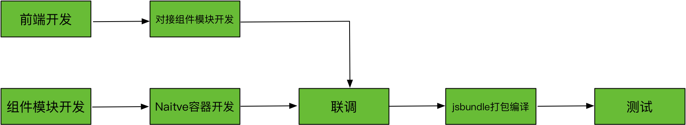

## 页面路由

1. 客户端打开某个内置⻚页⾯面:`appscheme://navigateTo/pageName`。

	> 一些可选参数:
viewType,视图类型,可选值:native、weex、h5,默认native tab, 若有多个Tab需要定位到的Tab名称或TabID 

2. 客户端打开某个非内置⻚页⾯面: appscheme://navigateTo/frameName? url=http://xx.com&key=value

## 生命周期提取，并统一命名（可选）
todo:

## 协同开发

